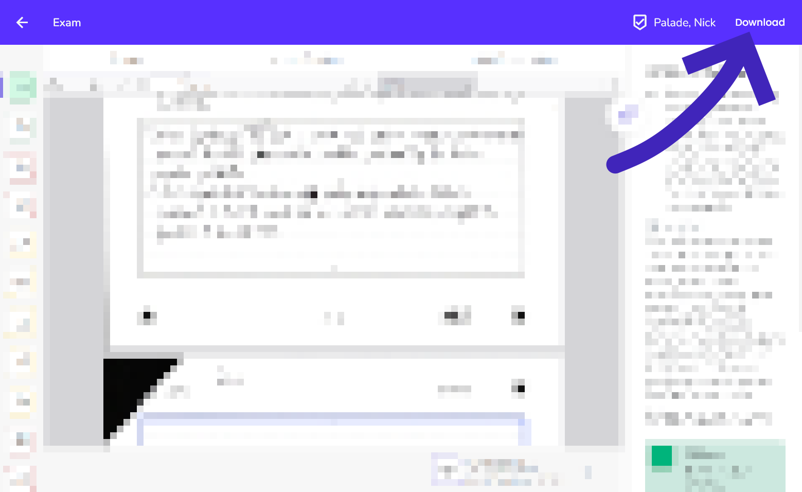

# ANS Downloader

Browser extension (Firefox & Chrome) that adds a **Download** button to the ANS grading/review page, letting you save your exam PDFs directly.

Originally created by [Z3r0byte](https://github.com/Z3r0byte/ANS-Downloader). This is an updated fork that fixes compatibility with the current ANS platform and adds Chrome support.

To quote the original creator: **"Is this legal? I hope so."**

---

## Installing — Firefox / Zen Browser

1. Download **[ANS-Downloader-firefox.xpi](ANS-Downloader-firefox.xpi)**
2. Go to **Add-ons & Themes** → cog wheel → **Install Add-on From File**
3. Select the downloaded `.xpi` file

---

## Installing — Chrome / Edge / Brave

1. Download **[ANS-Downloader-chrome.zip](ANS-Downloader-chrome.zip)** and unzip it
2. Go to `chrome://extensions` (or `edge://extensions`)
3. Enable **Developer mode** (toggle in top-right)
4. Click **Load unpacked** and select the unzipped folder

---

## Why download your exam?

Once you have your exam PDF, you can upload it directly to any AI (ChatGPT, Claude, Gemini, etc.) and ask it to explain the questions you got wrong, walk you through the model answers, or teach you the underlying concepts. It's a fast way to turn your graded exam into a personal study session.

---

## How it works

On any ANS grading review page (`/grading/view/...`), a **Download** button is injected into the toolbar. Clicking it:

- Finds all file tabs (Result, Formulas, etc.) and downloads each PDF directly using the presigned URLs embedded in the page
- Falls back to html2pdf rendering for older page layouts

---

## FAQ

**Does this work on Chromium based browsers?**\
Yes, as of this fork. The extension uses Manifest V3 which is supported by both Firefox and Chrome.

**Can I have feature X?**\
Only if you make it yourself. Pull Requests welcome.

**Are you going to steal my ANS session cookie?**\
Absolutely. After putting in the effort I at least want to have a laugh viewing your test results. *(— Z3r0byte)*

**Is this legal?**\
I hope so. *(— Z3r0byte)*

---

## License

Licensed under the [Apache 2.0 License](LICENSE).
Uses the [html2pdf.js](https://ekoopmans.github.io/html2pdf.js/) library by Erik Koopmans.
Original extension by [Z3r0byte](https://github.com/Z3r0byte/ANS-Downloader).
